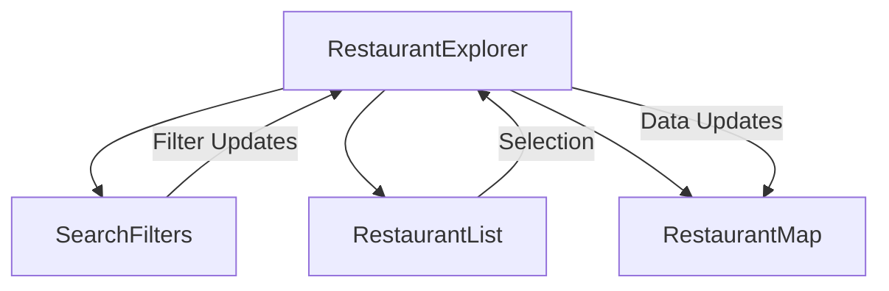

# Barbómetro Documentation

## Table of Contents
- [Introduction](#introduction)
- [Core Components](#core-components)
  - [RestaurantExplorer](#restaurantexplorer)
  - [SearchFilters](#searchfilters)
  - [RestaurantList](#restaurantlist)
  - [RestaurantMap](#restaurantmap)
- [Data Types](#data-types)
- [Filters and State Management](#filters-and-state-management)
- [Setup and Running](#setup-and-running)
- [Data Flow Architecture](#data-flow-architecture)
- [Error Handling](#error-handling)
- [Component Communication](#component-communication)
- [Mobile Responsiveness](#mobile-responsiveness)
- [State Management and Data Flow](#state-management-and-data-flow)
- [API Integration Details](#api-integration-details)
- [Filter Logic and Algorithms](#filter-logic-and-algorithms)
- [Performance Considerations](#performance-considerations)
- [Development Guidelines](#development-guidelines)

## Introduction

Barbómetro is a React/Next.js application that helps users discover and filter restaurants. It's built using TypeScript and modern React patterns. If you're familiar with traditional web development but new to React/TypeScript, this documentation will help you understand how the pieces fit together.

## Core Components

### RestaurantExplorer
`RestaurantExplorer` is the main orchestrator component. Think of it as the conductor of an orchestra - it manages the state and coordinates between all other components.

```typescript
// Key states explained:
const [restaurants, setRestaurants] = useState<Restaurant[]>([])          // All restaurants
const [filteredRestaurants, setFilteredRestaurants] = useState<Restaurant[]>([]) // Filtered list
const [selectedLocations, setSelectedLocations] = useState<string[]>([])  // Selected locations
const [selectedCuisines, setSelectedCuisines] = useState<string[]>(["all"]) // Selected cuisines
```

The component:
1. Fetches restaurant data on initial load
2. Manages all filter states
3. Coordinates between the map and list views
4. Handles responsive layout switching

### SearchFilters
This component handles all user input for filtering restaurants. It's like a control panel with multiple filter options.

Key features:
- Location multi-select with search
- Cuisine type multi-select
- Visit status toggle
- Price range selector
- Rating filter
- Sort options

Each filter is implemented as a controlled component, meaning React manages its state. For example:

```typescript
const [selectedLocations, setSelectedLocations] = useState<string[]>([])
const [locationSearch, setLocationSearch] = useState("")
```

The component uses modern React patterns like controlled inputs and lifting state up:
```typescript
interface SearchFiltersProps {
  onSearch: (term: string) => void
  onLocationFilter: (locations: string[]) => void
  // ... other callbacks
}
```

### RestaurantList
This component displays the filtered restaurants in a list format. It handles:
- Sorting of restaurants
- Display of restaurant details
- Loading states with skeletons
- Selection of restaurants for map highlighting

Key feature example - sorting restaurants:
```typescript
useEffect(() => {
  let sortedRestaurants = [...initialRestaurants];
  switch (sortOption) {
    case "rating":
      sortedRestaurants.sort((a, b) => b.ratingBarbudo - a.ratingBarbudo);
      break;
    // ... other sort options
  }
  setRestaurants(sortedRestaurants);
}, [sortOption, initialRestaurants]);
```

### RestaurantMap
Displays restaurants on an interactive map using Google Maps integration. It:
- Shows restaurant locations as markers
- Handles marker click events
- Manages map error states
- Provides fallback to list view if map fails to load

## Data Types

### Restaurant Interface
The core data type that shapes our restaurant information:

```typescript
interface Restaurant {
  id: number
  nome: string              // Restaurant name
  localidade: string        // Location
  coordenadasGPS?: string   // GPS coordinates (optional)
  googleMaps: string        // Google Maps link
  tipoCozinha: string      // Cuisine type(s)
  visitado: boolean        // Visited status
  rating: number           // Overall rating
  precoPorPessoa: string   // Price per person
  ratingBarbudo: number    // Barbudo's rating
  // ... other fields
}
```

## Filters and State Management

The application uses a combination of local state and prop drilling to manage filters. Here's how it works:

1. User interacts with a filter in `SearchFilters`
2. The component calls the appropriate callback (e.g., `onLocationFilter`)
3. `RestaurantExplorer` updates its state
4. The `useEffect` hook in `RestaurantExplorer` applies all active filters
5. Filtered results flow down to `RestaurantList` and `RestaurantMap`

Example of filter logic:
```typescript
// Location filter
if (selectedLocations.length > 0) {
  results = results.filter((restaurant) =>
    selectedLocations.some((location) => 
      restaurant.localidade.toLowerCase() === location.toLowerCase()
    )
  );
}
```

## Setup and Running

1. Install dependencies:
```bash
npm install
```

2. Run the development server:
```bash
npm run dev
```

3. Access the application at `http://localhost:3000`

## Data Flow Architecture

The application follows a top-down data flow pattern:

1. Data Source
   - Data is fetched from Google Sheets via the `fetchRestaurants` function
   - Has fallback mechanisms:
     - Primary: Google Sheets API
     - Secondary: Public sheet method
     - Fallback: Mock data

2. State Management
   - `RestaurantExplorer` acts as the state container
   - Uses multiple `useState` hooks for different concerns:
     ```typescript
     const [restaurants, setRestaurants] = useState<Restaurant[]>([])        // Source data
     const [filteredRestaurants, setFilteredRestaurants] = useState([])      // Filtered view
     const [selectedRestaurant, setSelectedRestaurant] = useState(null)      // Selected item
     ```

3. Filter Pipeline
   Each filter is applied sequentially in the main `useEffect`:
   ```typescript
   useEffect(() => {
     let results = restaurants
     // Search filter
     // Location filter
     // Cuisine filter
     // Visited status filter
     // Price range filter
     // Rating filter
     setFilteredRestaurants(results)
   }, [/* dependencies */])
   ```

## Error Handling

The application implements multiple layers of error handling:

1. Data Fetching
   - Primary API failure → Falls back to public sheet
   - Public sheet failure → Falls back to mock data
   - Complete failure → Shows user-friendly error message

2. Map Component
   - API key missing → Shows error alert
   - Loading failure → Falls back to list view
   - Script loading timeout → Shows retry option

3. User Feedback
   - Loading states with skeletons
   - Error messages in Portuguese
   - Retry mechanisms for recoverable errors

## Component Communication

The application uses a props-based communication pattern:

1. Parent-Child Communication
   - Props for data flow down
   - Callback functions for events up
   - Example:
     ```typescript
     // Parent (RestaurantExplorer)
     const handleLocationFilter = (locations: string[]) => {
       setSelectedLocations(locations)
     }

     // Child (SearchFilters)
     <SearchFilters onLocationFilter={handleLocationFilter} />
     ```

2. Sibling Communication
   - Happens through parent component
   - Example: List-Map interaction
     - List selection updates parent state
     - Parent passes selection to map
     - Map centers on selected restaurant

## Mobile Responsiveness

The application handles different viewport sizes:

1. View Modes
   - Desktop: Side-by-side list and map
   - Mobile: Toggle between list and map views
   ```typescript
   const isMobile = useMobile()
   const [mobileView, setMobileView] = useState<"map" | "list">("list")
   ```

2. Layout Adjustments
   - Responsive grid layouts
   - Adaptive height calculations
   - Touch-friendly interface elements

3. Mobile-specific Features
   - View toggle component
   - Auto-switch to map on selection
   - Optimized filter displays

## Tech Stack
- Next.js 14 with App Router
- React with TypeScript
- Tailwind CSS with shadcn/ui components
- Google Maps API integration
- Google Sheets API for data storage

## Best Practices Used
- TypeScript for type safety
- React hooks for state management
- Controlled components for form inputs
- Component composition
- Responsive design patterns
- Error boundaries and fallbacks
- Loading states and optimistic UI

## State Management and Data Flow

### State Architecture


### Key State Categories
1. **Source Data**
   - `restaurants`: Source of truth
   - `filteredRestaurants`: Computed results

2. **Filter States**
   ```typescript
   const [selectedLocations, setSelectedLocations] = useState<string[]>([])
   const [selectedCuisines, setSelectedCuisines] = useState<string[]>(["all"])
   const [visitedFilter, setVisitedFilter] = useState<string>("all")
   const [priceFilter, setPriceFilter] = useState<string>("all")
   const [barbudoRatingFilter, setBarbudoRatingFilter] = useState<number | null>(null)
   ```

3. **UI States**
   - `isLoading`: Loading indicators
   - `error`: Error handling
   - `mobileView`: Responsive layout
   - `selectedRestaurant`: Selected item

## API Integration Details

### Google Sheets Integration
1. **Data Fetching Pipeline**
```typescript
async function fetchRestaurants() {
  try {
    // Primary: Google Sheets API
    const data = await fetchFromGoogleSheetsAPI()
    return data
  } catch {
    // Secondary: Public sheet
    try {
      const data = await fetchFromPublicSheet()
      return data
    } catch {
      // Fallback: Mock data
      return getMockData()
    }
  }
}
```

2. **Error Handling Layers**
   - API key validation
   - Network error recovery
   - Data validation
   - Fallback mechanisms

### Google Maps Integration
1. **Map Component Integration**
   - Dynamic script loading
   - Error boundary implementation
   - Fallback to list view
   - Performance optimization

2. **Map Features**
   - Custom markers
   - Info windows
   - Center point calculation
   - Responsive zoom

## Filter Logic and Algorithms

### Filter Pipeline
1. **Search Filter**
   ```typescript
   if (searchTerm) {
     results = results.filter(restaurant =>
       restaurant.nome.toLowerCase().includes(searchTerm.toLowerCase()) ||
       restaurant.tipoCozinha.toLowerCase().includes(searchTerm.toLowerCase()) ||
       // ...more conditions
     )
   }
   ```

2. **Location Filter**
   - Multi-select implementation
   - Case-insensitive matching
   - "All" selection handling

3. **Price Filter**
   ```typescript
   const extractPrice = (priceString: string): number => {
     const match = priceString.match(/\d+/)
     return match ? Number.parseInt(match[0], 10) : 0
   }
   ```

### Sort Algorithms
1. **Name Sort**
   - Locale-aware sorting
   - Portuguese character handling

2. **Rating Sort**
   - Numeric comparison
   - Null handling

3. **Price Sort**
   - Price extraction
   - Numeric comparison

## Performance Considerations

### Optimization Techniques

1. **State Updates**
   - Batched state updates
   - Memoized callbacks
   - Debounced search

2. **Rendering Optimization**
   ```typescript
   // Example of optimized filtering
   const memoizedFilter = useCallback((items, term) => {
     return items.filter(item => 
       item.nome.toLowerCase().includes(term.toLowerCase())
     )
   }, [])
   ```

3. **Data Loading**
   - Progressive loading
   - Cached results
   - Loading indicators

### Memory Management
1. **Large Lists**
   - Virtualized scrolling
   - Pagination implementation
   - Cleanup on unmount

2. **Map Optimization**
   - Marker clustering
   - Viewport-based rendering
   - Event cleanup

### Performance Metrics
1. **Key Metrics**
   - Initial load time
   - Time to interactive
   - Filter response time

2. **Optimization Goals**
   - < 2s initial load
   - < 100ms filter response
   - < 16ms frame time

## Development Guidelines

### Adding New Features
1. **New Filters**
   - Add state in RestaurantExplorer
   - Create filter component
   - Add to filter pipeline
   - Update documentation

2. **New Views**
   - Create component
   - Add to layout system
   - Handle mobile/desktop
   - Update documentation